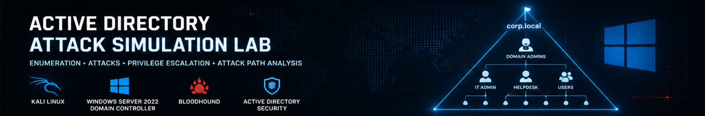
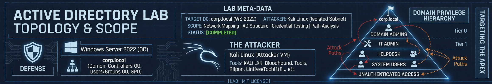
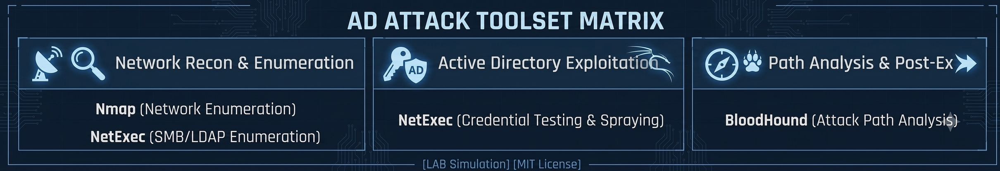
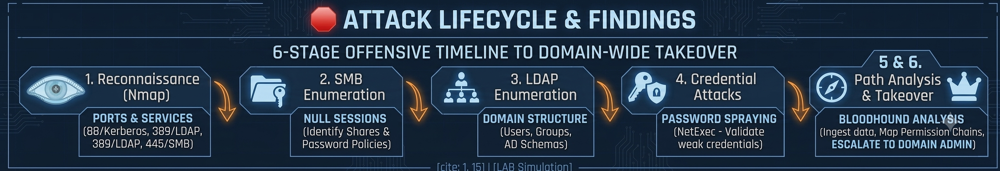

  

## 📌 Overview
This repository documents the deployment and offensive security assessment of an enterprise-grade Active Directory (AD) lab. The project objective was to build a realistic corporate environment, introduce common structural misconfigurations, and execute an end-to-end attack lifecycle from unauthenticated reconnaissance to full Domain Admin compromise.

---

## 🛠️ Lab Specifications & Environment
The deployment architecture utilizes virtualized isolation to replicate an enterprise environment, mapping a complete attack path from unauthenticated access up to Tier 0 assets.

  

* **Target Domain Controller:** Windows Server 2022 (`corp.local`)
* **Attacker Platform:** Kali Linux VM (Isolated Subnet)
* **Scope Constraints:** Network Mapping, AD Structure Misconfigurations, Credential Testing, and Graph Path Analysis.

---

### Weaponry & Utilities Used
The following key offensive testing utilities were leveraged across the assessment to discover, exploit, and track privilege escalation paths.

  

* **Recon & Discovery:** `Nmap` for network enumeration and `Kerbrute` for user enumeration.
* **AD Exploitation:** `NetExec`.
* **Path Analysis & Post-Ex:** `BloodHound` for relationship mapping and `CrackMapExec` for post-exploitation validation.

---

## 🛑 Attack Lifecycle & Findings
The assessment followed a structured, 6-stage offensive security timeline to progress from network footprinting to domain-wide takeover.

  

* **1. Reconnaissance (Nmap):** Identified open target ports and core infrastructure services (`88/Kerberos`, `389/LDAP`, `445/SMB`).
* **2. SMB Enumeration:** Discovered active null session permissions to harvest baseline password policies and system shares anonymously.
* **3. LDAP Enumeration:** Queried directory services unauthenticated to extract structural user accounts and group schemas.
* **4. Credential Attacks:** Executed horizontal password spraying to isolate weak accounts across the user directory.
* **5 & 6. Path Analysis & Takeover:** Ingested domain metadata into BloodHound to map hidden permission chains, allowing direct escalation to **Domain Admin**.

---

## 🛡️ Defensible Remediation
1. **Disable SMB Null Sessions:** Enforce explicit restrictions on anonymous network logons via Group Policy Objects (GPO).
2. **Mandate LDAP Signing:** Turn on strict LDAP signing constraints and Channel Binding requirements to neutralize cleartext queries.
3. **Deploy Fine-Grained Password Policies (FGPP):** Apply unique complexity rules and aggressive lockout settings to mitigate automated dictionary spraying.
4. **Audit AD ACLs:** Routinely analyze directory configurations using BloodHound to spot and eliminate unintended privilege delegation paths.

---

**Author:** AbdulRaheem
